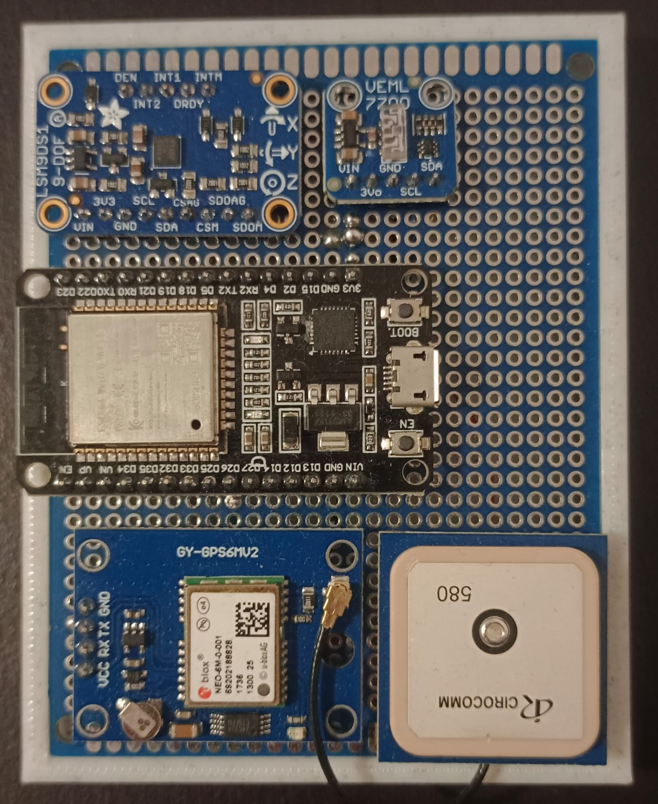

# ADCS Embedded Software

Research algorithm for the orientation of the `TEIDESAT-1` satellite


# Hardware

## IMU

The IMU `Adafruit LSM9DS1 9-DOF` is used. It containing multiple sensors for taking different measurements:  
- Acceleration (m/s^2): 3 accelerometers (XYZ axis)
- Rotation rate (rad/s): 3 gyroscopes (XYZ axis)
- Magnetic flux (G): 3 magnetometers (XYZ axis)
- Temperature (°C): temperature sensor

datasheet: [https://www.st.com/resource/en/datasheet/lsm9ds1.pdf]()  

## GNSS

The `U-BLOX NEO 6M` GNSS module is use for testing purposes and is not the final 

Guide to connect NEO 6M GPS to arduino  
[https://randomnerdtutorials.com/guide-to-neo-6m-gps-module-with-arduino]()

## Sun Sensor

Due to the high cost of sun sensors, light sensors will be used for the prototype. The `VEML7700` model is the one used in this case.

## Circuit configuration

Using an `Espressif ESP32-WROOM-32` microcontroller as the board computer. The `I2C` protocol is used for the comunication between the microcontroller and both the IMU module and the light sensor. For the GNSS module, the `UART` protocol is used.



Pin Conections:

|  Arduino  |   IMU   |  Light Sensor  |   GNSS   |
|:---------:|:-------:|:--------------:|:--------:|
|    3V3    |   VIN   |      VIN       |   VCC    |
|    GND    |   GND   |      GND       |   GND    |
|    D26    |   SDA   |      SDA       |          |
|    D27    |   SCL   |      SCL       |          |
|    RX2    |         |                |    TX    |
|    TX2    |         |                |    RX    |

## Software configuration

Used the `PlatformIO` plugin for VSCode to create the project and upload the attitude calculation program into the arduino board (configuration of the ESP-12E already set up in the project). Libraries requerided are already integrated in the project in the `.pio/libdeps/psp12e` directory (They can also be found in the `PlatformIO Registry`):

Main dependencies (look `platformio.ini` file for more information):
- adafruit/Adafruit LSM9DS1 Library@^2.2.1
- mikalhart/TinyGPSPlus@^1.1.0
- plerup/EspSoftwareSerial@^8.2.0

All the implementations are located in the `lib/algorithms` directory. 

```py
├── img                       # Documentation about the project
├── lib                       # INS (Inertial Navigation System) orientation source code                   
|    ├── hardware                   # Hardware abstraction to make it easier to connect with the algortihms (all sensors are attached and setup in INS.hpp)
|    ├── IMUlgortims                # IMU orientation algoritms
|    ├── sunSensorAlgorithms        # Sun Sensor orientation algoritms
|    └── utils                      # Utilities common to the IMU algorithms
├── src                       # Multiple main programs, one for each algorithm. Hardware sensor data is read and used to feed the algorithm
└── test
```

# Attitude Algorithm implementations

To upload the one of the implementations into the arduino board, change the name of the sketches in the `src/` directory from `main-IMPLEMENTATION-NAME.txt` to `main.cpp`. Every other implementation should end in `.txt` as only one main file should exist.


# Unit Tests

run all tests. Use desktop environment to not depend on esp
```sh
pio test -e desktop
```

run specific test suit
```sh
pio test -e desktop -f test_attitudeDetermination
```