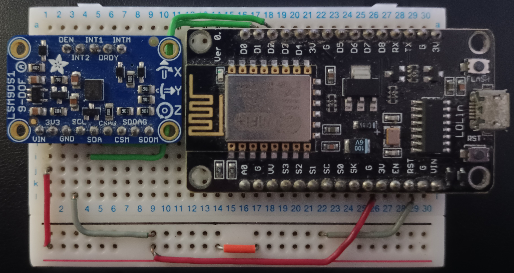

# IMU Attitude Determination

Research of a possible algorithm for the orientation of the `TEIDESAT-1` satellite.


## Hardware

### Inertial Measurement Unit (IMU)

The IMU `Adafruit LSM9DS1 9-DOF` is used. It containing multiple sensors for taking different measurements:  
- Acceleration (m/s^2): 3 accelerometers (XYZ axis)
- Rotation rate (rad/s): 3 gyroscopes (XYZ axis)
- Magnetic flux (G): 3 magnetometers (XYZ axis)
- Temperature (°C): temperature sensor

datasheet: [https://www.st.com/resource/en/datasheet/lsm9ds1.pdf]()  

### Circuit configuration

Using an `ESP-12E` microcontroller as the board computer. For the comunication between the microcontroller and the IMU, the `I2C` protocol is used, but both components should allow for the use of the `SPI` protocol as well.



Pin Conections (SPI protocol):

|  Arduino  |   IMU   | 
|:---------:|:-------:|
|    3V     |   VIN   |
|    G      |   GND   |
|    D1     |   SCL   |
|    D2     |   SDA   |

### Software configuration

Used the `PlatformIO` plugin for VSCode to create the project and upload the attitude calculation program into the arduino board (configuration of the ESP-12E already set up in the project). Libraries requerided are already integrated in the project in the `.pio/libdeps/psp12e` directory (They can also be found in the `PlatformIO Registry`):

Main dependencies:
- Adafruit LSM9DS1 Library
- ReefwingAHRS

Sub-dependencies (required by the main dependencies):
- Adafruit BusIO
- LIS3MDL
- LSM9DS1 Library

All the implementations are located in the `src/` directory. 

```
src/
├── adafruit/
|    └── ...
├── sebastian/
|    └── ...
├── upsat/
|    └── ...
├── main-adafruit-fork.txt
├── main-deltatime.txt
├── main-reefwing.txt
├── main-tris.txt
└── main-upsat.txt
```

### LSM9DS1 Library

Sinple script containing the basic configuration and how to read the data from the different sensors

```cpp
// dependencies
#include <Adafruit_LSM9DS1.h>

// LSM9DS1 object
Adafruit_LSM9DS1 lsm = Adafruit_LSM9DS1();

void setup() {
  Serial.begin(9600);
  while(!Serial) {delay(1);} // will pause Zero, Leonardo, etc until serial console opens
  
  // Try to initialise and warn if we couldn't detect the chip
  if(!lsm.begin()) {
    Serial.println("Oops ... unable to initialize the LSM9DS1. Check your wiring!");
    while (1);
  }

  // 1.) Set the accelerometer range
  lsm.setupAccel(lsm.LSM9DS1_ACCELRANGE_2G);
  //lsm.setupAccel(lsm.LSM9DS1_ACCELRANGE_4G);
  //lsm.setupAccel(lsm.LSM9DS1_ACCELRANGE_8G);
  //lsm.setupAccel(lsm.LSM9DS1_ACCELRANGE_16G);
  
  // 2.) Set the magnetometer sensitivity
  lsm.setupMag(lsm.LSM9DS1_MAGGAIN_4GAUSS);
  //lsm.setupMag(lsm.LSM9DS1_MAGGAIN_8GAUSS);
  //lsm.setupMag(lsm.LSM9DS1_MAGGAIN_12GAUSS);
  //lsm.setupMag(lsm.LSM9DS1_MAGGAIN_16GAUSS);

  // 3.) Setup the gyroscope
  lsm.setupGyro(lsm.LSM9DS1_GYROSCALE_245DPS);
  //lsm.setupGyro(lsm.LSM9DS1_GYROSCALE_500DPS);
  //lsm.setupGyro(lsm.LSM9DS1_GYROSCALE_2000DPS);
}

void loop() {
  // Get a new sensor event (obtain data from sensors)
  lsm.read();  // ask it to read in the data
  sensors_event_t accelerometers, magnetometers, gyroscopes, temperatureSensor;
  lsm.getEvent(&accelerometers, &magnetometers, &gyroscopes, &temperatureSensor);

  // raw sensor data
  float accelerationX = accelerometers.acceleration.x;
  float accelerationY = accelerometers.acceleration.y;
  float accelerationZ = accelerometers.acceleration.z;
  
  float rotationRateX = gyroscopes.gyro.x;
  float rotationRateY = gyroscopes.gyro.y;
  float rotationRateZ = gyroscopes.gyro.z;

  float magneticFluxX = magnetometers.magnetic.x;
  float magneticFluxY = magnetometers.magnetic.y;
  float magneticFluxZ = magnetometers.magnetic.z;

  float temperature = temperatureSensor.temperature;
}
```


## Attitude Algorithm implementations

To upload the one of the implementations into the arduino board, change the name of the sketches in the `src/` directory from `main-IMPLEMENTATION-NAME.txt` to `main.cpp`. Every other implementation should end in `.txt` as only one main file should exist.

### Upsat

UPSat ADCS software modified to be used with arduino instead of Raspberry

File where the algorithm is implemented: `main-upsat.txt`

ADCS software folder in their repository:  
[https://gitlab.com/librespacefoundation/upsat/upsat-adcs-software/-/tree/master/sensor-fusion-test?ref_type=heads]()

### ReefwingAHRS

Library implementating different algorithms for the calculation of the orientation with an easy to setup interface. Using the `Madgwick algorithm` as it is better than the `Mahony algorithm`.  

File where the algorithm is implemented: `main-reefwing.txt`

Reefwing Library repository (also avalible in the )
[https://github.com/Reefwing-Software/Reefwing-AHRS]() 

### Adafruit-fork

Adafruit`s fork library for the implementation of the main orientation algoritms (madgick and mahony).

File where the algorithm is implemented: `main-adafruit-fork.txt`

Adafruit references a fork of their library in one of their tutorial pages:  
[https://learn.adafruit.com/ahrs-for-adafruits-9-dof-10-dof-breakout/sensor-fusion-algorithms]()

Base repository:  
[https://github.com/adafruit/Adafruit_AHRS/tree/master]()

Fork repository:  
[https://github.com/PaulStoffregen/MadgwickAHRS]() (madgwick algorithm)  
[https://github.com/PaulStoffregen/MahonyAHRS]() (mahony algorithm)

### Trigonometry 

Implementation based but not following exactly all the steps on the tutorial. Test the output of every sensor and simple sensor fusion. This implementation is not reliable for use in any kind of vehichle but just an aproximation on how the sensors works.

File where the algorithm is implemented: `main-trigonometry.txt`

tutorial serie for sensor fusion using trigonometry:  
[https://www.youtube.com/watch?v=2AO_Gmh5K3Q&list=PLGs0VKk2DiYwEo-k0mjIkWXlkrJWAU4L9&index=1&ab_channel=PaulMcWhorter]()

### Deltatime

Using the trigonometry implementation as base to test if it is required to compensate the value returned by the gyroscopes. The value returned by this sensor is in degrees per second (dps) but a loop takes less than that to execute. The solution is to apply the rotation done in the time it took to complete a loop, use the time interval also know as deltatime (degrees = dps * deltatime). **After executing, the deltatime does not change the result obtained in the trigonometry implementation. This deltaTime may be already calculated in the LSM9DS1 library**

File where the algorithm is implemented: `main-deltatime.txt`