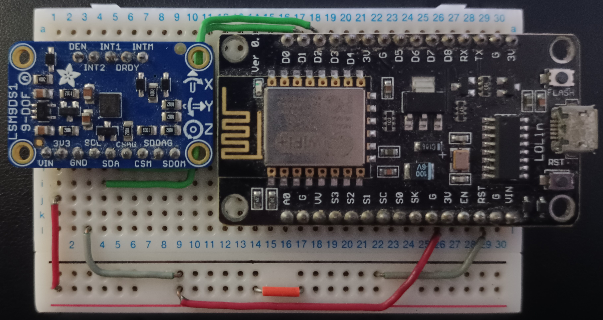

# ADCS Embedded Software

Research algorithm for the orientation of the `TEIDESAT-1` satellite


# Hardware

## IMU

The IMU `Adafruit LSM9DS1 9-DOF` is used. It containing multiple sensors for taking different measurements:  
- Acceleration (m/s^2): 3 accelerometers (XYZ axis)
- Rotation rate (rad/s): 3 gyroscopes (XYZ axis)
- Magnetic flux (G): 3 magnetometers (XYZ axis)
- Temperature (°C): temperature sensor

datasheet: [https://www.st.com/resource/en/datasheet/lsm9ds1.pdf]()  

## GNSS

The `NEO 6M` GNSS module is use for testing purposes and is not the final 

Guide to connect NEO 6M GPS to arduino  
[https://randomnerdtutorials.com/guide-to-neo-6m-gps-module-with-arduino]()

## Sun Sensor

Due to the high cost of sun sensors, light sensors will be used for the prototype. The `VEML7700` model will be used.

## Circuit configuration

Using an `Espressif ESP8266 esp-12E` microcontroller as the board computer. The `I2C` protocol is used for the comunication between the microcontroller and the IMU, 



Pin Conections (SPI protocol):

|  Arduino  |   IMU   | 
|:---------:|:-------:|
|    3V     |   VIN   |
|    G      |   GND   |
|    D1     |   SCL   |
|    D2     |   SDA   |

## Software configuration

Used the `PlatformIO` plugin for VSCode to create the project and upload the attitude calculation program into the arduino board (configuration of the ESP-12E already set up in the project). Libraries requerided are already integrated in the project in the `.pio/libdeps/psp12e` directory (They can also be found in the `PlatformIO Registry`):

Main dependencies (look `platformio.ini` file for more information):
- adafruit/Adafruit LSM9DS1 Library@^2.2.1
- mikalhart/TinyGPSPlus@^1.1.0
- plerup/EspSoftwareSerial@^8.2.0

All the implementations are located in the `lib/algorithms` directory. 

```py
├── img                       # Documentation about the project
├── lib                       # INS orientation source code                   
|    ├── hardware                   # Hardware abstraction to make it easier to connect with the algortihms (all sensors are attached and setup in INS.hpp)
|    ├── IMUlgortims                # IMU orientation algoritms
|    ├── sunSensorAlgorithms        # Sun Sensor orientation algoritms
|    └── utils                      # Utilities common to the IMU algorithms
├── src                       # Multiple main programs, one for each algorithm. Hardware sensor data is read and used to feed the algorithm
└── test
```


# Attitude Algorithm implementations

To upload the one of the implementations into the arduino board, change the name of the sketches in the `src/` directory from `main-IMPLEMENTATION-NAME.txt` to `main.cpp`. Every other implementation should end in `.txt` as only one main file should exist.

## Upsat

UPSat ADCS software modified to be used with arduino instead of Raspberry

File where the algorithm is implemented: `main-upsat.txt`

ADCS software folder in their repository
[https://gitlab.com/librespacefoundation/upsat/upsat-adcs-software/-/tree/master/sensor-fusion-test?ref_type=heads]()


## Acubesat

Algorithm based on ACUBESAT´s implementation. This implementation relies mostly in the gyroscopes to calculate the relative movement.
https://gitlab.com/acubesat/adcs/adcs-software/business-logic-software

## ReefwingAHRS

Library implementating different algorithms for the calculation of the orientation with an easy to setup interface. Using the `Madgwick algorithm` as it is better than the `Mahony algorithm`.  

File where the algorithm is implemented: `main-reefwing.txt`

Reefwing Library repository
[https://github.com/Reefwing-Software/Reefwing-AHRS]() 

## Adafruit-fork

Adafruit`s fork library for the implementation of the main orientation algoritms (madgick and mahony).

File where the algorithm is implemented: `main-adafruit-fork.txt`

Adafruit references a fork of their library in one of their tutorial pages:  
[https://learn.adafruit.com/ahrs-for-adafruits-9-dof-10-dof-breakout/sensor-fusion-algorithms]()

Base repository 
[https://github.com/adafruit/Adafruit_AHRS/tree/master]()

Fork repository
[https://github.com/PaulStoffregen/MadgwickAHRS]() (madgwick algorithm)  
[https://github.com/PaulStoffregen/MahonyAHRS]() (mahony algorithm)

## Trigonometry 

Implementation based but not following exactly all the steps on the tutorial. Test the output of every sensor and simple sensor fusion. This implementation is not reliable for use in any kind of vehichle but just an aproximation on how the sensors works.

File where the algorithm is implemented: `main-trigonometry.txt`

tutorial serie for sensor fusion using trigonometry:  
[https://www.youtube.com/watch?v=2AO_Gmh5K3Q&list=PLGs0VKk2DiYwEo-k0mjIkWXlkrJWAU4L9&index=1&ab_channel=PaulMcWhorter]()